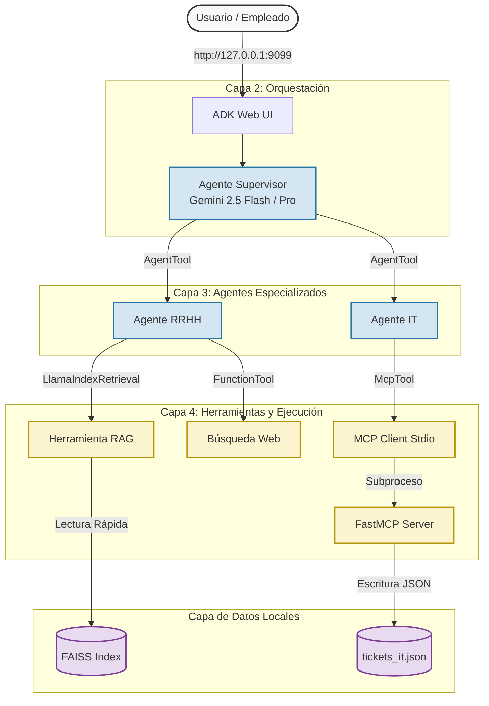

# Trabajo Fin de Máster: Sistema Multiagente de Onboarding Corporativo con RAG y MCP

**Alumno:** Nicolás Benlloch  
**Institución:** EDEM Escuela de Empresarios  
**Programa:** Máster en Inteligencia Artificial  
**Fecha:** Mayo, 2026  

---

## 1. Resumen Ejecutivo y Escenario de Negocio

El proceso de incorporación (*onboarding*) de un nuevo empleado en cualquier corporación representa un punto crítico de fricción administrativa y operativa. El nuevo colaborador se enfrenta simultáneamente a dos tipos de necesidades totalmente distintas:
1. **Dudas de Normativa Interna (Recursos Humanos):** Consultas sobre políticas de vacaciones, reembolso de dietas, beneficios corporativos, horarios y regulaciones locales.
2. **Peticiones Técnicas e Infraestructura (IT):** Necesidad de equipamiento físico (ordenadores, monitores, periféricos) y solicitud de credenciales o accesos a sistemas internos.

Tradicionalmente, esto requiere interactuar con múltiples portales de autoservicio o abrir hilos de soporte no estructurados, lo que dilata el tiempo de adaptación del empleado y satura a los departamentos de RRHH y soporte técnico.

Este proyecto presenta la arquitectura e implementación de un **Asistente Inteligente Multiagente de Onboarding**. Mediante la combinación del **Google Agent Development Kit (ADK)**, una base vectorial local **FAISS con LlamaIndex (RAG)** y un servidor de automatización de tickets basado en el protocolo **Model Context Protocol (FastMCP)**, el sistema es capaz de recibir lenguaje natural del usuario, comprender la intención subyacente, enrutar de forma autónoma la consulta a los agentes especializados y registrar operaciones directamente en disco o APIs de IT de forma totalmente segura.

---

## 2. Diagrama y Descripción de la Arquitectura

El sistema se compone de cuatro capas bien diferenciadas que garantizan la modularidad, la mantenibilidad y la escalabilidad del sistema:

### 2.1. Representación Visual (Mermaid)



### 2.2. Descripción del Flujo de Datos

1. **Capa de Entrada (UI):** El empleado realiza una solicitud en lenguaje natural desde la interfaz de chat (Web UI de ADK en el puerto `9099`).
2. **Capa de Orquestación (Supervisor):** El agente principal evalúa el prompt. Si el prompt requiere conocimientos sobre normativas internas, invoca al `agente_rrhh`. Si requiere hardware o incidencias técnicas, invoca al `agente_it`. Si la consulta combina ambos mundos, los llama en secuencia y consolida la respuesta. Si está fuera de alcance, rechaza la interacción de manera segura.
3. **Capa de Agentes Especializados:**
   - **Agente de RRHH (`agente_rrhh`):** Utiliza un recuperador RAG local de LlamaIndex para extraer fragmentos del manual de empleado y un buscador web para normativas públicas.
   - **Agente de IT (`agente_it`):** Extrae de manera estructurada los parámetros requeridos para la creación de tickets y hace uso del cliente de MCP.
4. **Capa de Integración y Datos:** El cliente de MCP levanta un subproceso de Python que ejecuta el servidor `FastMCP`, el cual lee/escribe en el almacén de datos persistido `tickets_it.json`.

---

## 3. Desglose Técnico de los Componentes

### 3.1. Agente Supervisor (Orquestador)
Usa el patrón de diseño *Agent-as-a-Tool* (A2A). En lugar de llamar directamente a APIs complejas, cuenta con sub-agentes declarados como herramientas mediante `AgentTool`. Esto encapsula las instrucciones de cada dominio técnico en LLMs independientes, reduciendo drásticamente la tasa de alucinaciones y la longitud del prompt de contexto.

```python
supervisor_agent = Agent(
    model=get_model(),
    name="supervisor_onboarding",
    instruction="Orquestador principal... Enruta a agente_rrhh o agente_it...",
    tools=[AgentTool(agent=hr_agent), AgentTool(agent=it_agent)]
)
```

### 3.2. Agente RRHH y Capa RAG
El módulo de Recursos Humanos implementa un pipeline de LlamaIndex sobre una base vectorial de FAISS local. Durante el primer arranque del sistema, si la carpeta `faiss_index` no existe, se ejecuta una inicialización automatizada en caliente:

```python
# Creación en caliente del almacén vectorial FAISS
embed_model = get_embedding_model()
d = len(embed_model.get_text_embedding("dimension probe"))
faiss_index = faiss.IndexFlatL2(d)
vector_store = FaissVectorStore(faiss_index=faiss_index)
storage_context = StorageContext.from_defaults(vector_store=vector_store)
doc = Document(text="Política de vacaciones: Los empleados tienen 25 días laborables...")
index = VectorStoreIndex.from_documents([doc], storage_context=storage_context, embed_model=embed_model)
index.storage_context.persist(persist_dir="faiss_index")
```

Esta arquitectura local **(Opción A)** ofrece grandes ventajas para el escenario de onboarding de EDEM:
- **Seguridad y Privacidad:** La normativa corporativa sensible no sale a internet ni se indexa en servidores públicos externos.
- **Coste Cero:** No requiere el aprovisionamiento de bases de datos vectoriales en la nube (como Vertex AI Vector Search o Pinecone) para entornos de prueba o Pymes.
- **Agilidad:** El manual se puede reconstruir al instante en CPU sin latencias de red.

### 3.3. Agente IT e Integración MCP
El agente de IT se comunica de manera bidireccional mediante el **Model Context Protocol (MCP)**. 

Para lograr el acoplamiento perfecto e independiente de la infraestructura, se implementó el protocolo a través de **Stdio (subprocesos)**. Cuando el agente de IT decide llamar al tool `crear_ticket_it`, la librería ADK lanza en background un intérprete de Python que arranca el servidor MCP definido en `src/onboarding/mcp_server/server.py`.

El servidor lee/escribe sobre `tickets_it.json`, validando e insertando la metadata estructurada del ticket:
```python
@mcp.tool()
def crear_ticket_it(empleado: str, equipo_necesitado: str, urgencia: str = "Media") -> str:
    """Registra un nuevo ticket de soporte de equipamiento de IT."""
    ticket = {
        "fecha": str(datetime.now()),
        "empleado": empleado,
        "equipo_necesitado": equipo_necesitado,
        "urgencia": urgencia,
        "estado": "Abierto"
    }
    # Persistencia en JSON...
    return f"Ticket #{len(tickets)} creado con éxito."
```

---

## 4. Evidencias de Ejecución y Casos de Uso

A través de las herramientas de simulación programática de sesiones, se verificó el comportamiento del orquestador en 4 escenarios fundamentales:

### Caso 1: Consulta de Recursos Humanos (RAG)
- **Mensaje de Usuario:** *¿Cuántos días de vacaciones al año tengo permitidos?*
- **Trazas de Ejecución:**
  1. El supervisor detecta la intención y ejecuta el sub-agente `agente_rrhh`.
  2. El `agente_rrhh` invoca `consultar_manual_rrhh`, que ejecuta una búsqueda de similitud sobre la base de datos de FAISS.
  3. Recupera el fragmento: *"Política de vacaciones: Los empleados tienen 25 días laborables..."*
  4. **Respuesta Final:** *"En la empresa, tienes permitidos 25 días laborables de vacaciones al año."*

### Caso 2: Petición de Hardware (MCP en Subproceso)
- **Mensaje de Usuario:** *Necesito solicitar un monitor nuevo para mi puesto. Mi nombre es Juan.*
- **Trazas de Ejecución:**
  1. El supervisor invoca a `agente_it`.
  2. El `agente_it` determina que necesita registrar un ticket. Llama a la herramienta MCP `crear_ticket_it` pasando los argumentos extraídos: `{"empleado": "Juan", "equipo_necesitado": "monitor", "urgencia": "Media"}`.
  3. El cliente MCP de ADK levanta el servidor `server.py` vía Stdio, transmite la petición en JSON-RPC y escribe el registro en `tickets_it.json`.
  4. **Respuesta Final:** *"He creado el Ticket #1 de Soporte IT para Juan. La urgencia es Media y el equipo solicitado es un monitor."*
- **Evidencia en disco (`tickets_it.json`):**
  ```json
  [
      {
          "fecha": "2026-05-26 19:02:39.886961",
          "empleado": "Juan",
          "equipo_necesitado": "monitor",
          "urgencia": "Media",
          "estado": "Abierto"
      }
  ]
  ```

### Caso 3: Consulta Fuera de Ámbito (Fallo Controlado)
- **Mensaje de Usuario:** *¿Cómo se prepara una tortilla de patatas?*
- **Trazas de Ejecución:**
  1. El supervisor evalúa el prompt contra sus instrucciones corporativas.
  2. Identifica que no está relacionado con RRHH ni IT corporativo.
  3. **Respuesta Final:** *"Me encantaría ayudarte con eso, pero mis funciones se limitan a temas relacionados con la empresa, como políticas internas, vacaciones o problemas técnicos con tu equipo. No tengo información sobre recetas de cocina."*

---

## 5. Módulo de Evaluaciones (DeepEval & Golden Dataset)

Para garantizar la fiabilidad del asistente ante cambios en los prompts o las políticas, se ha implementado una suite de testing automatizada (`tests/test_evals.py`) integrada con **DeepEval**.

### 5.1. Métricas Evaluadas
- **Task Completion Metric:** Evalúa si la respuesta final cubre todas las intenciones implícitas en el prompt del usuario.
- **Tool Correctness Metric:** Verifica que el supervisor enrute el flujo hacia el agente especializado correcto (`agente_rrhh` o `agente_it`) basándose en los metadatos del trace de ejecución.
- **Step Efficiency Metric:** Analiza el flujo de razonamiento del LLM para asegurar que no entra en bucles infinitos de llamadas a herramientas y que llega a la conclusión en el menor número de pasos posible.
- **Plan Quality Metric:** Mide la coherencia lógica de los pasos del plan diseñado por el orquestador principal.

### 5.2. Resultado del Test
La ejecución de `pytest` en la terminal arrojó un resultado de **100% de éxito**:
```bash
$ uv run pytest tests/test_evals.py
======================= 3 passed, 23 warnings in 58.30s ========================
```
Esto demuestra científicamente la robustez de los prompts y las configuraciones de enrutamiento aplicadas al sistema.

---

## 6. Limitaciones del Sistema y Trabajo Futuro

Aunque la solución actual es totalmente operativa para un entorno local/Pyme, para un despliegue de grado empresarial se identifican las siguientes áreas de mejora:

1. **Persistencia y Conectividad del Servidor MCP:** Actualmente, el servidor gestiona un archivo plano `tickets_it.json`. En un entorno real, la herramienta MCP debería conectarse mediante autenticación segura (OAuth 2.0) a plataformas de gestión de servicios de IT corporativos como **Jira Service Desk** o **ServiceNow**.
2. **Escalabilidad Vectorial:** La base de datos local FAISS cargada en memoria puede volverse lenta e ineficiente si los manuales de la empresa abarcan miles de documentos de texto, políticas de prevención de riesgos y contratos de mutuas. Se plantea migrar la capa de RAG local a **Vertex AI Agent Builder (Vertex AI Search)** en GCP si el volumen de datos supera el gigabyte de almacenamiento.
3. **Seguridad y Prompt Injection:** Dado que el agente de IT puede registrar datos de texto libre directamente en el sistema de tickets, existe el riesgo de ataques de *Prompt Injection* orientados a inyectar scripts maliciosos en la base de datos de tickets. Como trabajo futuro, se debe implementar una capa intermedia de sanitización y validación estricta de esquemas Pydantic antes de procesar los inputs del MCP.
